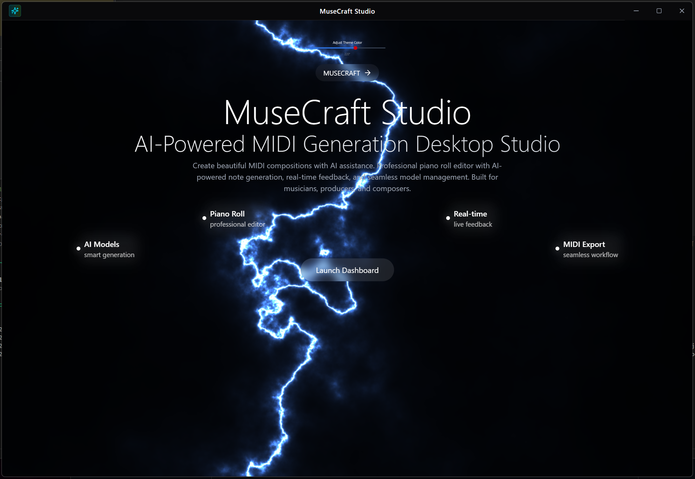
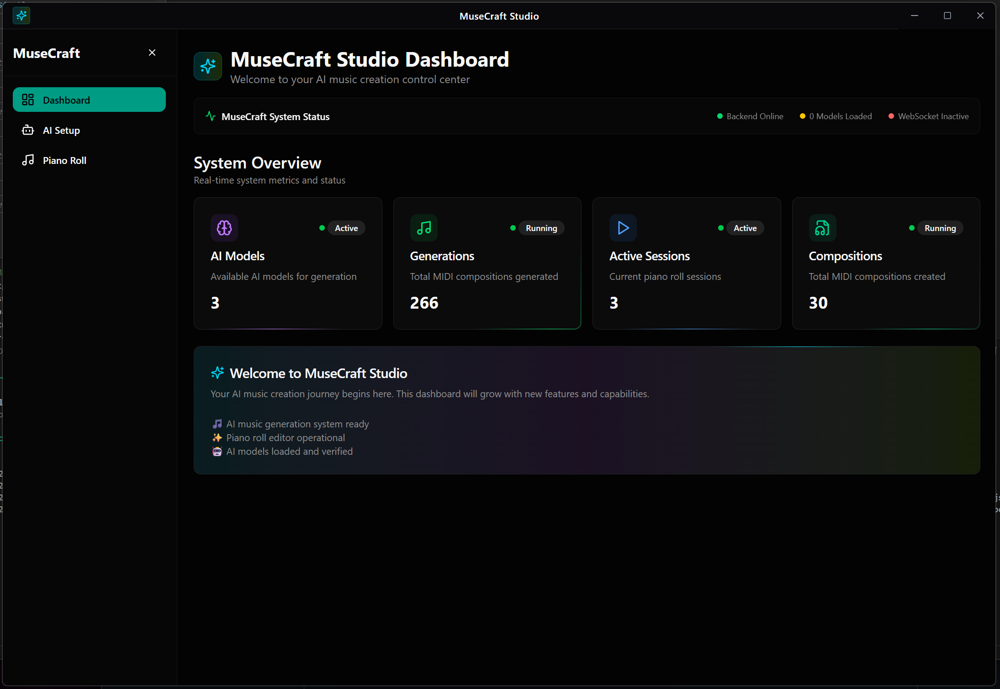
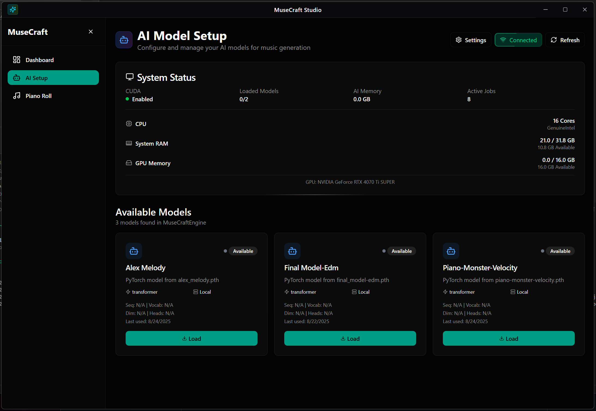
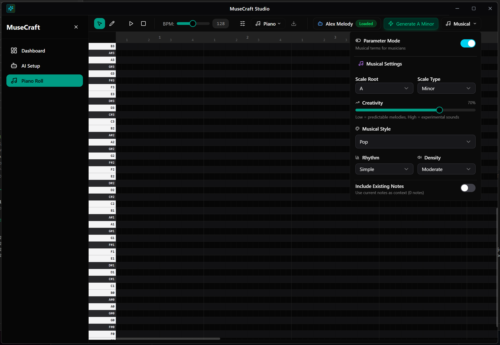
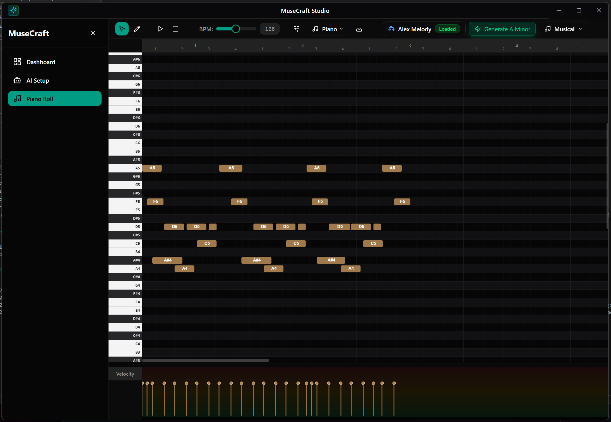

# 🎵 MuseCraft - AI MIDI Generation Studio

**Professional AI-Powered MIDI Generation Desktop Application**

🎹 **Create beautiful MIDI compositions with AI assistance**

## 🎯 What is MuseCraft?

MuseCraft is a professional desktop application that combines the power of AI with intuitive MIDI composition tools. Create, edit, and generate stunning MIDI compositions using advanced AI models, all within a beautiful and user-friendly interface.

## ✨ Key Features

- 🤖 **AI-Powered MIDI Generation** - Generate musical notes using advanced AI models
- 🎹 **Professional Piano Roll Editor** - Full-featured MIDI editor with precision controls
- 🎵 **Real-time Playback** - Hear your compositions instantly
- 🎛️ **Advanced Controls** - Fine-tune velocity, timing, and musical parameters
- 🖥️ **Beautiful Interface** - Modern, responsive design built for creators

## 📸 App Preview

### 🌟 Landing Page
Experience MuseCraft's beautiful welcome interface with smooth animations and modern design.

### 📊 Dashboard
Your creative hub with quick access to all features and project management.

### 🤖 AI Setup
Easy AI model management with real-time status monitoring and intuitive controls.

### 🎼 Piano Roll Studio
Professional MIDI editor where the magic happens - create, edit, and generate music.

### 🎚️ Advanced Controls
Fine-tune your compositions with velocity lanes and detailed note editing.

## 🚀 Getting Started

### Step 1: Welcome to MuseCraft
Launch the application and explore the beautiful landing page that introduces you to all the powerful features available.

### Step 2: Navigate to AI Setup
Before creating music, set up your AI models:
- Browse available AI models
- Load your preferred model
- Monitor model status in real-time
- Test connectivity and performance

### Step 3: Open the Piano Roll
Access the main composition workspace:
- View the professional piano roll interface
- Explore the piano keyboard on the left
- Check out the timeline and measure markers
- Familiarize yourself with the AI generation toolbar

### Step 4: Generate Your First Composition
1. **Set Parameters**: Adjust creativity, note count, and timing
2. **Click Generate**: Let AI create musical ideas for you
3. **Listen & Edit**: Play back and refine your composition
4. **Fine-tune**: Adjust velocities and note positions

### Step 5: Advanced Editing
- **Velocity Control**: Use the velocity lane to add dynamics
- **Precise Timing**: Snap notes to grid or free-form placement
- **Note Selection**: Select multiple notes for batch editing
- **Real-time Preview**: Hear changes instantly as you edit

## 🎵 How to Create Music

### Basic Workflow
1. **Start with AI Generation**
   - Choose your desired musical style and parameters
   - Generate initial musical ideas with AI
   - Use the generated notes as a foundation

2. **Refine Your Composition**
   - Edit note positions and lengths
   - Adjust velocities for realistic dynamics
   - Add or remove notes manually

3. **Perfect the Details**
   - Fine-tune timing and rhythm
   - Balance velocity levels across notes
   - Create musical phrases and structures

### Pro Tips
- 💡 **Experiment with Parameters**: Try different AI settings for varied results
- 🎯 **Layer Generations**: Generate multiple parts and combine them
- 🎨 **Mix AI and Manual**: Use AI for inspiration, then manually refine
- 🔄 **Iterate**: Generate, edit, and regenerate to perfect your sound

## 🎨 Interface Guide

### Piano Roll Components
- **Piano Keys** (Left): Click to hear notes and identify pitches
- **Grid Area** (Center): Visual representation of your MIDI notes
- **Timeline** (Top): Shows measures, beats, and time positions
- **AI Toolbar** (Right): Generation controls and parameters
- **Velocity Lane** (Bottom): Edit note dynamics and expression

### Navigation
- **Sidebar**: Quick access to all app sections
- **Header**: Current page and breadcrumb navigation
- **Status Indicators**: Real-time connection and model status

## 🎭 Use Cases

### 🎼 Composers
- Generate initial musical ideas and themes
- Explore new harmonic progressions
- Break through creative blocks

### 🎵 Producers
- Create backing tracks and accompaniments
- Generate rhythm patterns and bass lines
- Develop melodic hooks and riffs

### 🎹 Musicians
- Practice with AI-generated exercises
- Explore different musical styles
- Learn from AI-created patterns

### 🎓 Students
- Study music theory through AI examples
- Analyze generated compositions
- Experiment with different musical concepts

## 🏆 Why Choose MuseCraft?

- **🚀 Easy to Use**: Intuitive interface designed for all skill levels
- **🎯 Professional Quality**: Industry-standard MIDI editing capabilities
- **🤖 AI-Powered**: Cutting-edge AI models for creative assistance
- **⚡ Real-time**: Instant feedback and live generation
- **🎨 Beautiful**: Modern, responsive design that inspires creativity
- **🔧 Flexible**: Customize everything to match your workflow

## 🎉 Ready to Create?

Download MuseCraft and start your musical journey today. Whether you're a seasoned professional or just starting out, MuseCraft provides the tools and AI assistance you need to create amazing music.

---

**🎵 For technical documentation and development guide, please refer to `docs/technical.md`**

**Start creating beautiful music with AI assistance! 🎹✨**

