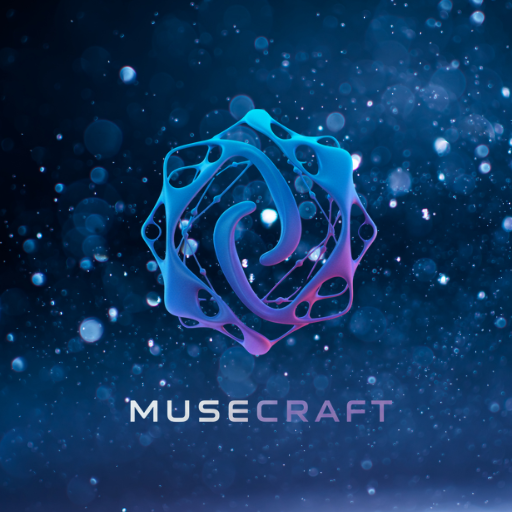

# 🎵 MuseCraft Studio - AI MIDI Generation Desktop App

<div align="center">



**🎹 Professional AI-Powered MIDI Generation Desktop Application**

[](LICENSE)
[](https://nodejs.org/)
[](https://electronjs.org/)
[](https://typescriptlang.org/)
[](https://react.dev/)

**Create beautiful MIDI compositions with AI assistance**

</div>

## 🎯 What is MuseCraft Studio?

MuseCraft Studio is a professional desktop application built with **Electron, React 19, and TypeScript** that combines AI music generation with intuitive MIDI editing. It provides a seamless workflow from AI model management to professional MIDI composition.

### ✨ Key Features
- **🤖 AI Model Management**: Load and manage AI models with real-time status monitoring
- **🎹 Professional Piano Roll Editor**: Full-featured MIDI editor with velocity control
- **⚡ Real-time Communication**: WebSocket integration with MuseCraftEngine backend
- **🎵 MIDI Import/Export**: Compatible with all major DAWs and music software
- **🎨 Modern UI**: Beautiful interface built with shadcn/ui + Tailwind CSS

## 🚀 Quick Installation Guide

### ⚠️ **IMPORTANT: Setup MuseCraftEngine First**

Before using MuseCraft Studio's AI features, you **MUST** set up and run the MuseCraftEngine backend:

**🔗 [MuseCraftEngine Repository](https://github.com/WebChatAppAi/MuseCraftEngine)**

#### Quick Engine Setup:
```bash
# 1. Clone the engine
git clone https://github.com/WebChatAppAi/MuseCraftEngine.git
cd MuseCraftEngine

# 2. Install PyTorch for your system (CUDA/CPU/MPS)
# NVIDIA GPU: pip install torch --index-url https://download.pytorch.org/whl/cu118
# Apple Silicon: pip install torch
# CPU Only: pip install torch --index-url https://download.pytorch.org/whl/cpu

# 3. Install dependencies
pip install -r requirements.txt

# 4. Download AI models from HuggingFace
# Visit: https://huggingface.co/projectlosangeles/MuseCraft/tree/main
# Download .pth files and place them in: ./data/models/

# 5. Start the engine
python main.py
```

✅ **Verify engine is running**: Visit http://localhost:8899/docs

### Studio Installation

#### Prerequisites
- **Node.js 18+** and **pnpm** (recommended) or npm
- **MuseCraftEngine Backend** running on `http://localhost:8899` ⬆️
- **Git** for cloning the repository

#### Install and Run Studio

```bash
# 1. Clone the repository
git clone https://github.com/WebChatAppAi/MuseCraft-Studio.git
cd MuseCraft-Studio

# 2. Install dependencies  
pnpm install
# or: npm install --legacy-peer-deps

# 3. Start the application (ensure engine is running on localhost:8899)
pnpm dev
```

## 🎼 Piano Roll Studio Preview


*The main creative workspace where AI meets professional MIDI editing*

## 🎵 First-Time Setup

### Step 0: **CRITICAL - Ensure Backend is Ready**
🚨 **Before launching MuseCraft Studio, you MUST have:**
1. ✅ **MuseCraftEngine running** on http://localhost:8899
2. ✅ **AI models downloaded** from [HuggingFace](https://huggingface.co/projectlosangeles/MuseCraft/tree/main)
3. ✅ **Models placed** in `MuseCraftEngine/data/models/` directory

**Without the engine, AI features will not work!**

### Step 1: Launch MuseCraft Studio
The application opens to the **Quantum Landing** page with a beautiful animated welcome interface.

### Step 2: Navigate to AI Setup  
Click "AI Setup" in the sidebar to access the model management hub:
- **Test Backend Connection**: Verify MuseCraftEngine is running on localhost:8899
- **Discover Models**: Automatically scan for available AI models from your engine
- **Load Model**: Select and load your preferred model into memory  
- **Monitor Status**: Real-time WebSocket updates show model loading progress

### Step 3: Access the Piano Roll Studio
Navigate to "Piano Roll" to enter the main composition workspace:
- **Grid Area**: Visual MIDI note representation with canvas-based rendering
- **Piano Keyboard**: Left sidebar with note names and octave navigation
- **Timeline**: Top ruler showing measures, beats, and time positions
- **AI Toolbar**: Right panel with generation controls and parameters
- **Velocity Lane**: Bottom area for editing note dynamics

### Step 4: Generate Your First Composition
1. **Configure AI Parameters**: Set creativity level, note count, and musical style
2. **Click "Generate"**: AI creates notes based on your parameters
3. **Real-time Updates**: Watch generation progress via WebSocket notifications
4. **Edit Results**: Refine generated notes using the professional editor tools

## 🎭 Use Cases

### 🎼 **For Composers**
- Generate initial musical ideas and themes
- Explore new harmonic progressions
- Break through creative blocks

### 🎵 **For Producers**
- Create backing tracks and accompaniments
- Generate rhythm patterns and bass lines
- Develop melodic hooks and riffs

### 🎹 **For Musicians**
- Practice with AI-generated exercises
- Explore different musical styles
- Learn from AI-created patterns

### 🎓 **For Students**
- Study music theory through AI examples
- Analyze generated compositions
- Experiment with different musical concepts

## 📚 Documentation

### 🔗 **Required Components**
- **🚀 [MuseCraftEngine](https://github.com/WebChatAppAi/MuseCraftEngine)** - AI backend server (REQUIRED for AI features)
- **🤖 [AI Models](https://huggingface.co/projectlosangeles/MuseCraft/tree/main)** - Pre-trained models from HuggingFace

### 📖 **Documentation**
- **📘 [Complete Usage Guide](docs/usage-guide.md)** - Detailed interface guide and creative workflows
- **📋 [Technical Documentation](docs/technical.md)** - Architecture details and API reference
- **🛠️ [Contributing Guide](docs/technical.md#🤝-contributing)** - How to contribute to MuseCraft development

### ⚠️ **Setup Reminder**
**Remember**: MuseCraft Studio is the frontend interface. For AI music generation, you need:
1. 🔧 **MuseCraftEngine** running on localhost:8899
2. 📥 **AI models** downloaded and placed in engine's data/models/ folder
3. ✅ **Connection verified** through Studio's AI Setup page

---

<div align="center">

**🎵 Start creating beautiful music with AI assistance! 🎹✨**

*Made with ❤️ for the AI music community*

</div>